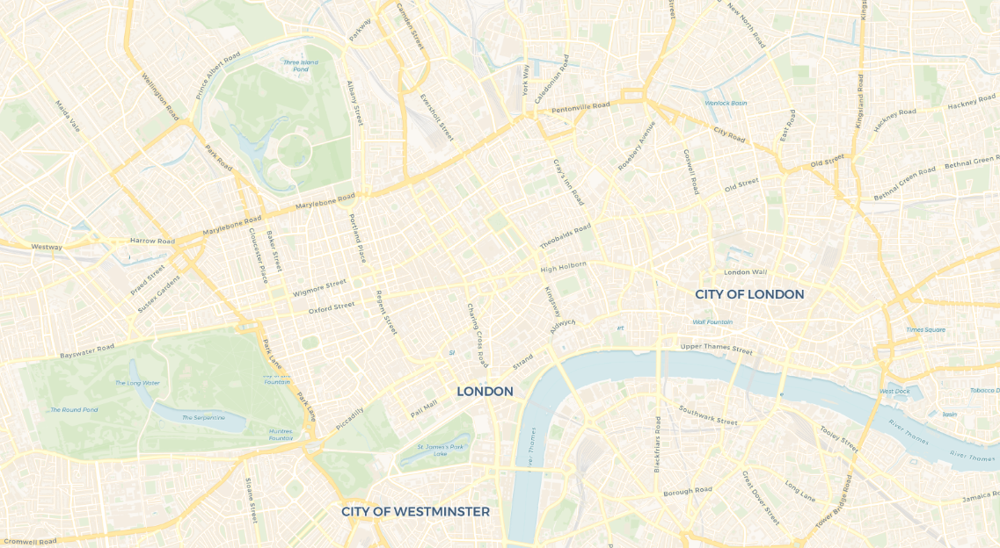
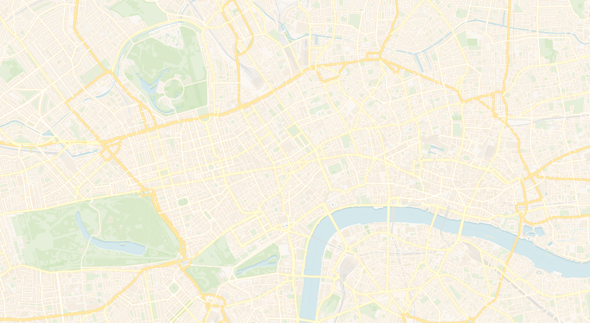
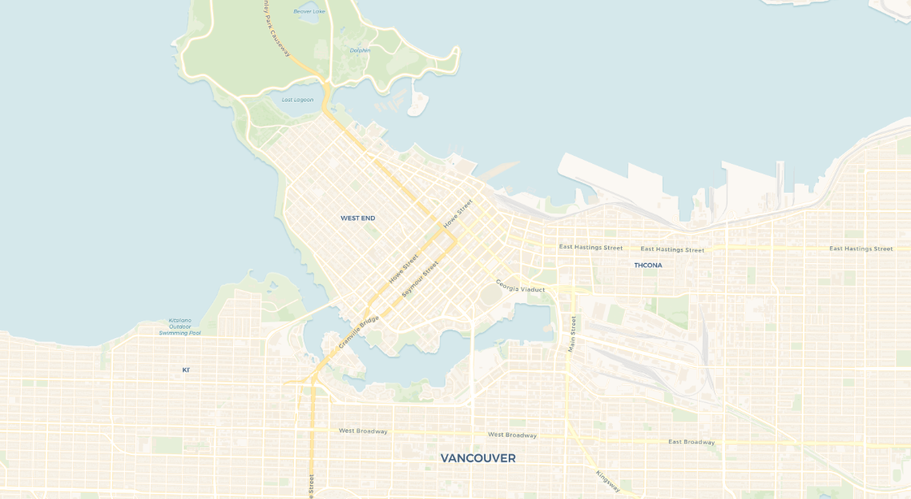
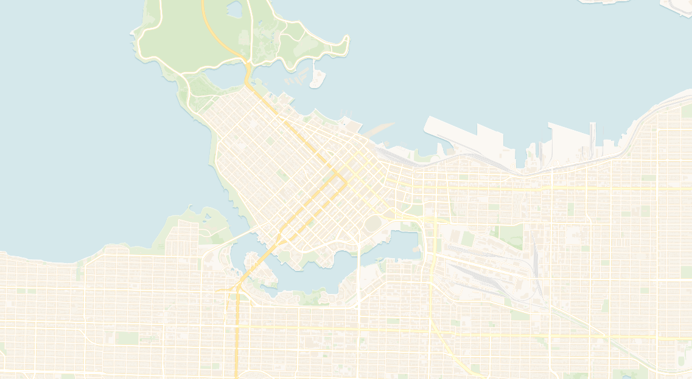
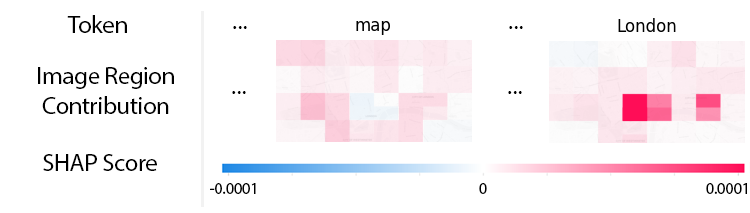
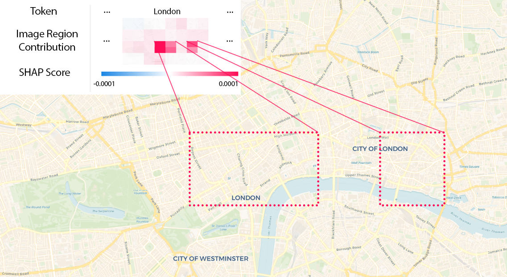
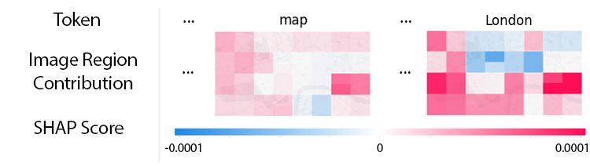
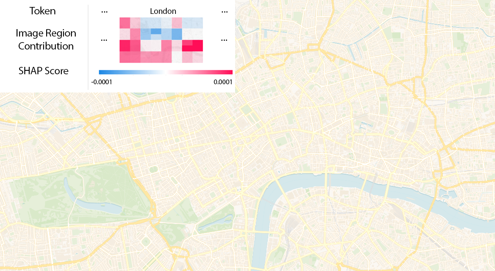
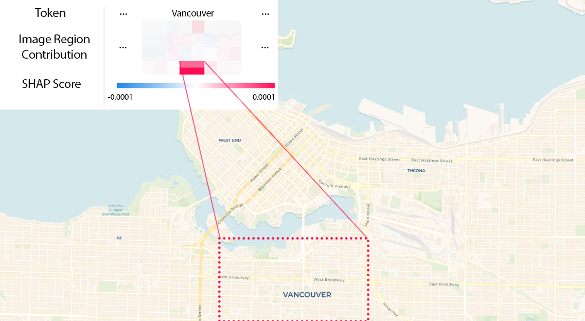

# What do you see? An XAI approach for VLM-generated map descriptions

This repository accompanies our research paper on Explainable AI for maps using Vision Language Models (VLMs). It focuses on interpreting the output of VLMs to enable researches to better understand the decision-making processes of VLMs.

## Overview
Cartographic maps have become increasingly accessible to diverse communities over the past decades. However, accessibility for blind and visually impaired users remains a challenge. This project investigates the use of VLMs to generate map descriptions and applies Shapley-based Explainable AI methods to analyze and interpret the outputs of these models.

### Key Contributions
1. **Explainability through XAI:** Using Shapley Additive Explanations to understand how specific map regions contribute to generated text outputs.
2. **Insights for Accessibility:** Highlighting the impact of map scale and labeling on the quality of generated descriptions. Proposing selective masking strategies for deeper insights.

---

## Project Structure

```
root
├── map_images          # Sample maps that were used for the paper
├── results             # Final explanations and masked images (used in the paper)
├── CartoXAI.ipynb      # Code used for VLM captioning, masking, and XAI analysis
└── README.md           # Project overview and instructions
```
## Requirements

To run the code in this repository, you'll need:
- Python 3.8+
- PyTorch
- SHAP (for Explainable AI computations)
- Hugging Face Transformers library

Install the dependencies using:

```bash
pip install -r requirements.txt
```

## Usage
1. **Prepare the Data:**
   - Place your map images in the `map_images/` directory.
   - Ensure images are named appropriately (e.g., `london_with_labels.png`, `vancouver_no_labels.png`).

2. **Run Caption Generation:**
   - Use the provided script to generate captions for both original and masked images.

3. **Compute Shapley Values:**
   - Analyze the contribution of specific map regions to the generated captions.
   - Visualize the results.

---

## Example Data and Results

### Data & Generated Map Descriptions
**London, Scale 1:50,000, with labels**

**VLM output:** *"The image is a detailed map of London, England, showing the city’s streets, landmarks, and surrounding areas."*

**London, Scale 1:50,000, without labels**

**VLM output:** *"The image is a detailed map of London, England, showing the city’s streets, landmarks, and surrounding areas."*

**Vancouver, Scale 1:50,000, with labels**

**VLM output:** *"The image is a detailed map of Vancouver, Canada, showing streets, landmarks, and a body of water."*

**Vancouver, Scale 1:50,000, without labels**

**VLM output:** *"The image is a detailed map of a city, showing streets, parks, and a body of water."*

---

### Map Descriptions Excerpt (Scale 1:50,000)
**London including labels:**



**Highlighting the corresponding area in the original image:**



**London excluding labels:**



**Overview of the area compared to the original image:**



**Vancouver including labels:**



**Full visualizations can be found in the `results/` directory.**

---

## Future Work

- **Selective Masking Strategies:** Replacing grid-based masking with targeted masking of cartographic elements (e.g., labels, rivers) for deeper insights.
- **Improving VLM Outputs:** Investigating methods to enhance the detail and accuracy of descriptions generated by VLMs.

---

## Citation

If you use this repository, please cite our work:

```bibtex
@article{dinga-schiewe-icc25,
  author    = {tba},
  title     = {tba},
  journal   = {tba},
  year      = {tba},
}
```

---

## License
This repository is licensed under the MIT License. See `LICENSE` for more details.

---

## Acknowledgments & Credits
We thank the open-source communities behind SHAP, Hugging Face, and CARTO Basemaps for their tools and datasets.

- Parts of the code are directly taken from [SHAP](https://github.com/shap/shap)
- Look up especially: [SHAP Image Captioning](https://shap.readthedocs.io/en/latest/example_notebooks/image_examples/image_captioning/Image%20Captioning%20using%20Open%20Source.html)
- [Carto Basemaps](https://carto.com/basemaps)


---

## Open Points
- We are currently working on a web-based system where users can upload their own images to receive explanation plots and masked images without having to set up everything locally.
- Prepare a docker container for better dependency management.